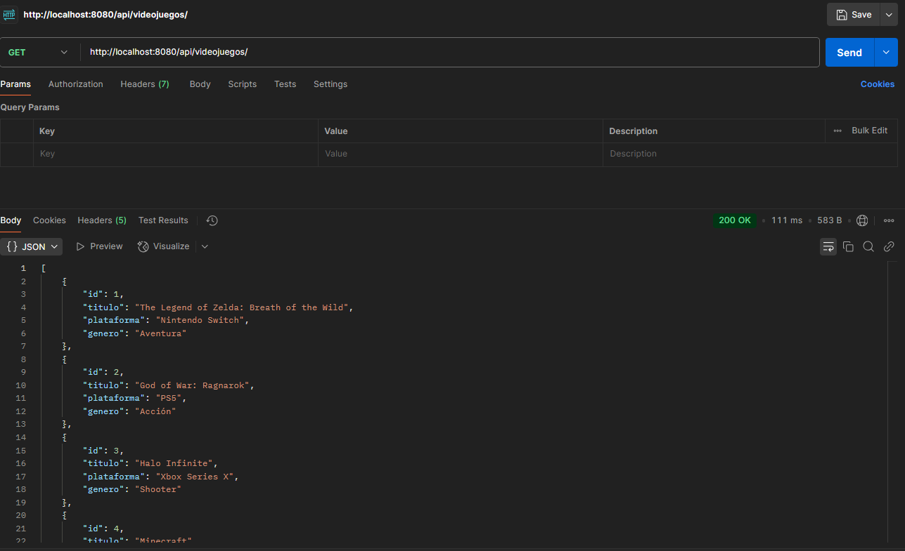
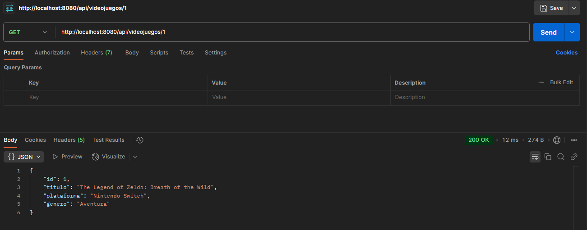
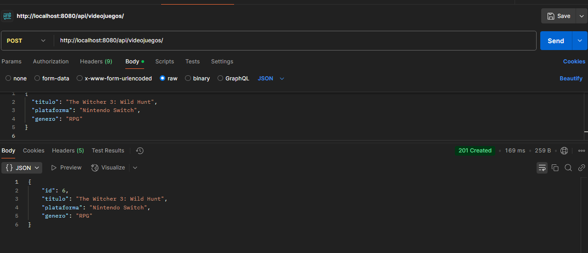
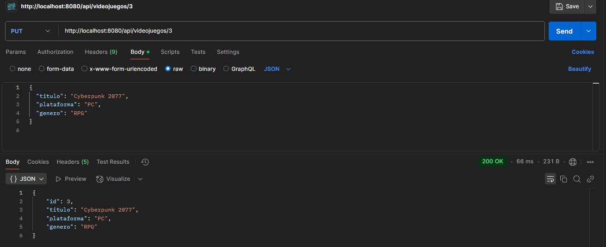
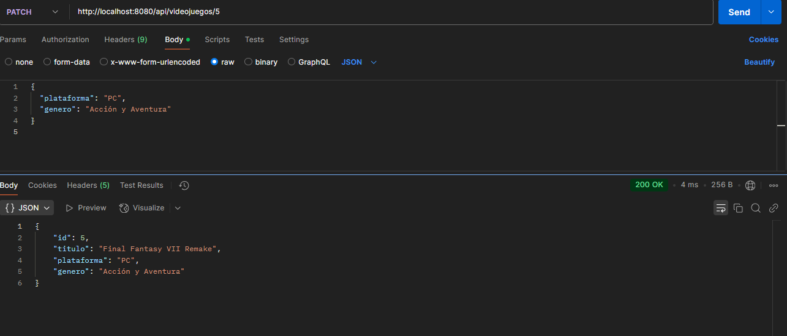
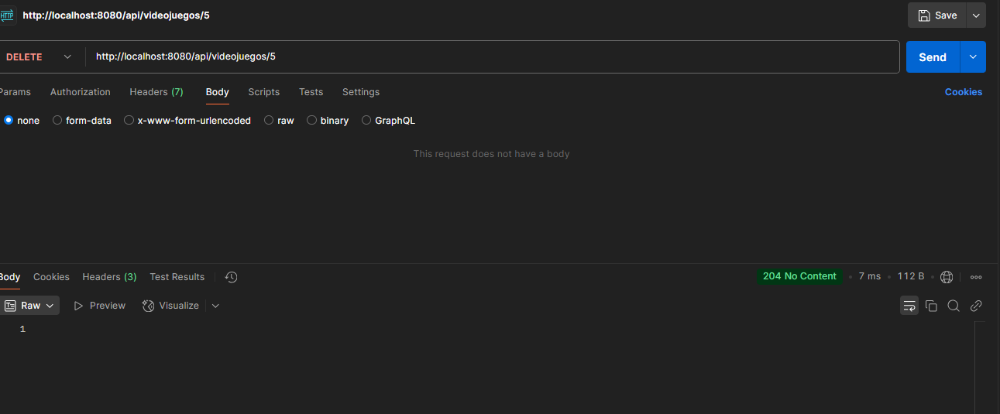

# API REST de Videojuegos 🎮

Este proyecto es una API REST construida con Spring Boot que permite gestionar una colección de videojuegos.

## Endpoints principales

### `GET /api/videojuegos` – Obtener todos los videojuegos

### `GET /api/videojuegos/{id}` – Obtener videojuego por ID

### `POST /api/videojuegos` – Crear nuevo videojuego

### `PUT /api/videojuegos/{id}` – Actualizar completamente un videojuego

### `PATCH /api/videojuegos/{id}` – Actualizar parcialmente un videojuego

### `DELETE /api/videojuegos/{id}` – Eliminar un videojuego

## Créditos

- José de Jesús Castillo Nolasco

## Tecnologías

- Java 17
- Spring Boot
- Thymeleaf
